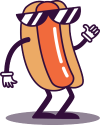

## Introduction

In this activity, you will use the amazing online machine learning engine called teachable machine with Scratch to create a project that will recognise different objects! (In this case, it's our Hacker Hotdog mascot.)

### What you will make

--- no-print ---
In this activity, you will use a cloud-based machine learning engine called Teachable Machine (with Scratch!) to create a project that will recognise a single image class (a hotdog) and tell you when it detects this image. 

  <iframe allowtransparency="true" width="485" height="402" src="https://scratch.mit.edu/projects/embed/160619869/?autostart=false" frameborder="0"></iframe>

--- /no-print ---

--- print-only ---

--- /print-only ---

--- collapse ---
---
title: What you will need
---
### Hardware

+ A computer or tablet capable of running Scratch 3
+ A webcam

### Software

+ This project can only be completed using a special [online only 'fork'](http://rpf.io/ml-scratch){:target="_blank"} of Scratch 3 

### Downloads

+ Download the project [starter file](http://rpf.io/p/en/projectName-go){:target="_blank"} if working offline

--- /collapse ---

--- collapse ---
---
title: What you will learn
---

+ How to create **classes** for a machine learning model
+ How to use the `Video sensing`{:class="block3extensions"} and `Teachable Machine`{:class="block3extensions"} extensions in Scratch 3

--- /collapse ---

--- collapse ---
---
title: Additional information for educators
---

You can download the completed project [here](https://rpf.io/p/en/hotdog-not-hotdog-get){:target="_blank"}.

If you need to print this project, please use the [printer-friendly version](https://projects.raspberrypi.org/en/projects/projectName/print){:target="_blank"}.

--- /collapse ---
