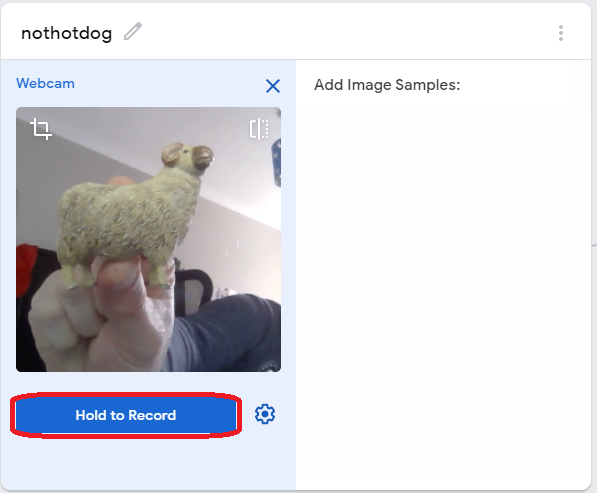

## Create a machine learning model

In this activity, you will use the amazing online machine learning engine called Teachable Machine with Scratch to create a project that will recognise different objects!

Teachable Machine is a web-based tool created by Google that makes creating machine learning models fast, easy, and accessible to everyone. This project requires a connection to the cloud-based machine learning engine, so you cannot work on this project offline.

Let's get started!

--- task ---
You are going to use Teachable Machine to create a vision project, so go to the [Teachable Machine website](https://teachablemachine.withgoogle.com/train){:target="_blank"} and choose **Image Project** from the three options:
 

--- /task ---
Here, you can see your model **Workflow**:

First, you will add some classes on the left-hand side. **Classes** are the different sets of data that we give to Teachable Machine.

Once you have created your data sets as classes, you will train Teachable Machine to recognise similarities and differences between your images in the class.

Once it is trained, you will test and **export** your model so that it can be used in Scratch!

--- task ---
Choose an object or picture to use as your subject. In this example, we will use an image of the Hotdog mascot, but you could also use a toy or other image.

--- /task ---

--- task ---

In the box labelled **Class 1**, click the button labelled **Webcam**. If the browser asks you for permission to use the camera, click on **Allow**.

--- collapse ---
---
title: Safety tip
--- 
For this project, point your camera away from your face or sit out of the shot, to make sure that you are not storing images of yourself on the cloud unnecessarily. 
--- /collapse ---

--- /task ---

--- task ---

Take your object or image and hold it in front of your webcam.

Hold down the blue **Hold to Record** button and move your object around in front of the camera so that it captures all the sides and odd angles that you can show the camera.

--- collapse ---
---
title: Tip
---
Try not to sit too still if you are in the shot — if you are too still, Teachable Machine might recognise you instead of the thing that you are holding up!

--- /collapse ---

--- /task ---

--- task ---
Rename the class to the thing that you are holding up in the picture. This will help when you begin working in Scratch. In this example, we have called the class **Hotdog**.

--- /task ---

Teachable Machine will not work with just one class. It needs a second class to compare against, so you will create that now.

--- task ---
Change the name of your second empty class to `not` and the name of your object. In this example, we have called the class **nothotdog**.

--- /task ---

--- task ---
Hold down the **Hold to Record** button under your empty class and move around in front of your camera, or hold up several things that are **not** your object.

This will train Teachable Machine on things that are **not** your object and allow it to compare.

--- /task ---

Now that you have created your two data sets, you will train the model to recognise the difference between them and tell you if it sees your object or something else.

--- task ---
To the right-hand side of your data sets, there is a grey button labelled **Train Model**.

Click the **Train Model** button to begin training Teachable Machine:

**IMPORTANT:** Do **not** close or change your browser tab while you are waiting, or the training will not work!

--- /task ---

When you have clicked the **Train Model** button, a progress bar will appear where the button was, showing how far through the training process Teachable Machine has progressed:

--- task ---
Once you have trained your model, you can test that it works correctly: hold up the objects or images one at a time and watch the changing bars on the right-hand side of the screen. These bars show the model's certainty that it is looking at the object shown in one of the classes that you made:

Switch between different objects and watch the model predict what it is seeing!

--- /task ---

The next step is to **export** your model. This means saving the model online so that you can use it in your Scratch project.

--- task ---
To export your model, click the **Export Model** button on the top right-hand side of your screen:

This will show you a pop-up asking you to choose a few options, but you can just use the default settings provided.

Make sure that **Upload (shareable link)** is selected, and click the button that says **Upload my model**. This will save your image recognition model to the cloud and return a URL that you can use in Scratch.

--- /task ---

--- task ---
Copy the URL shown under **Your sharable link**. To do this, click the **Copy** button.

Leave this tab open, or paste your URL into a text file so that you don't lose it — you will need it in Scratch in the next step!
--- /task ---
