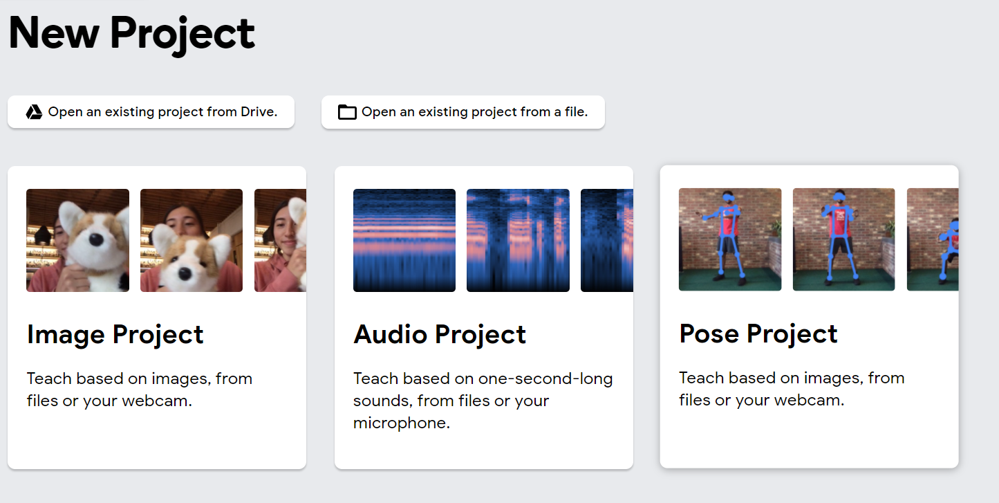

## Make an image detector

ANow you're going to take your exported model and make an image detector in Scratch!

--- task ---

If working **online**, open the [starter project](http://rpf.io/p/en/projectName-on){:target="_blank"} in Scratch.
 
If working **offline**, open the project [starter file](http://rpf.io/p/en/projectName-get){:target="_blank"} in the Scratch offline editor. If you need to download and install Scratch, you can find it [here](https://scratch.mit.edu/download){:target="_blank"}.

You should see...
 

--- /task ---

--- task ---

Step content...

--- /task ---

--- save ---
