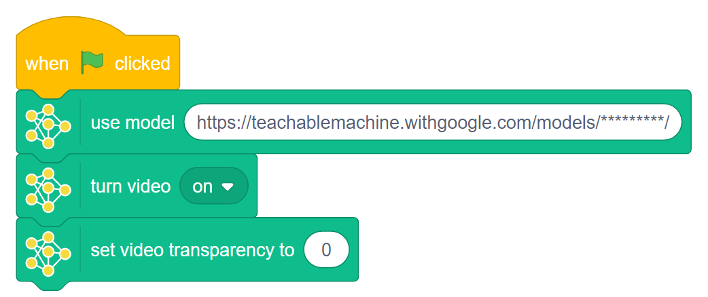

## Make an image detector

In this step, you will take your exported model and make an image detector in Scratch!

--- task ---
Open the [blank machine learning Scratch project](http://rpf.io/ml-scratch){:target="_blank"} (if you haven't already).

--- collapse ---
---
title: Tip
---
You can open a blank machine learning Scratch project any time by going to [rpf.io/ml-scratch](http://rpf.io/ml-scratch){:target="_blank"}!

--- /collapse ---

--- /task ---

You should see the Scratch environment that you are used to, with a few small differences. The project should contain a single sprite named **Dani**.

--- task ---

Make sure that the **Dani** sprite is selected before you start to code.

--- /task ---

On the left-hand side, you will notice some new blocks menus that do not exist in the version of Scratch that you are used to. These are special extensions created by MIT to work with some really cool new technology, and they make this fork incompatible with the version of Scratch that you usually use.

This means that any projects that you make in this fork of Scratch will not work in the version of Scratch that you are used to.

--- collapse ---
---
title: How to save your work
---
This fork of Scratch is different to the version of Scratch that you are used to, so you will not be able to save your work in the same way as in Scratch, and your project will be incompatible with your Scratch account. You will need to download your project to your device, and open it again **in this specific online version of Scratch** to use or edit it.

--- /collapse ---

--- task ---
For this project, you need to open the `Teachable Machine`{:class="block3extensions"} blocks menu:

--- /task ---

--- task ---
Paste the URL that you copied from Teachable Machine in the previous step into the `use model`{:class="block3extensions"} block at the top of the `Teachable Machine`{:class="block3extensions"} blocks menu:

This will direct Scratch to access the model that you just created and stored on the cloud, so that it can detect **your** images.

--- /task ---

--- task ---

Add the updated `use model`{:class="block3extensions"} block, along with a `when green flag clicked`{:class="block3events"} block, in the Code area:

--- /task ---

This means that when you start your program, Scratch will immediately access your model from where it is stored. This takes a little time to initiate the first time you use it, so be patient when you run your project later.

--- task ---

Now, add a `turn video on`{:class="block3extensions"} block to make sure that your camera can detect things, and a `set video transparency to`{:class="block3extensions"} `0` block so that the picture that it provides is as clear as possible:

--- /task ---

--- task ---

Click on the green flag to instantiate your model and to check if the camera is working.

--- /task ---

Now, you need to create the script that will detect your two different classes using the model that you have just linked.

--- task ---

Drag a `when model detects`{:class="block3extensions"} block into the Code area and choose the name of your first class in the drop-down menu. In this example, it is `hotdog`{:class="block3extensions"}.

--- /task ---

--- task ---

Drag a `say`{:class="block3looks"} block into the Code area and add a message that will say what is detected.

--- /task ---

--- task ---

Repeat the above step for your second class. In this example, it is `nothotdog`{:class="block3extensions"}.

--- /task ---

--- task ---

Click on the green flag to run your new image detector!

--- /task ---
