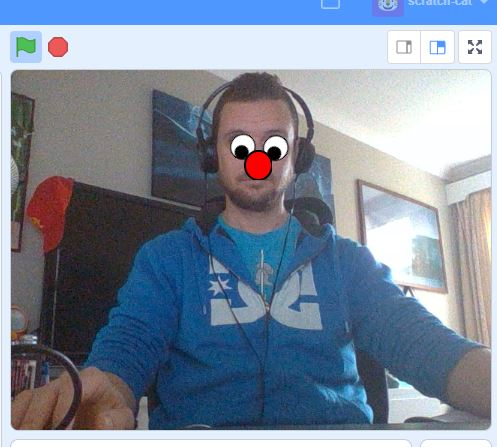

## What next?
In this project, we imported a unique data set, then trained a model to recognise the classes of data within that set and tested that it works. What you now do with a machine that can detect a specific image or object is up to you! 

For starters, you could:
- Add sounds to your project for each class
- Have the sprite change costume for each class
- Add more classes to your cloud model
- Create a project that requires a certain image to be shown to solve a riddle
- Create a face recogniser for your friends and family!

If you are following the [Machine vision](https://projects.raspberrypi.org/en/raspberrypi/machine-vision) pathway, you can move on to the [Funny face follower](https://projects.raspberrypi.org/en/projects/funny-face-follower) project. In this project, you will make a cartoon mask that can detect your face and will follow it around the screen!

If you want to have more fun exploring Scratch, then you could try out any of [these projects](https://projects.raspberrypi.org/en/projects?software%5B%5D=scratch&curriculum%5B%5D=%201).
